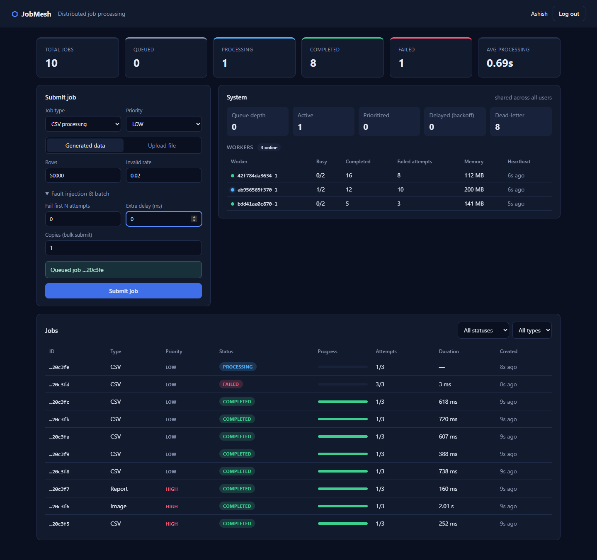
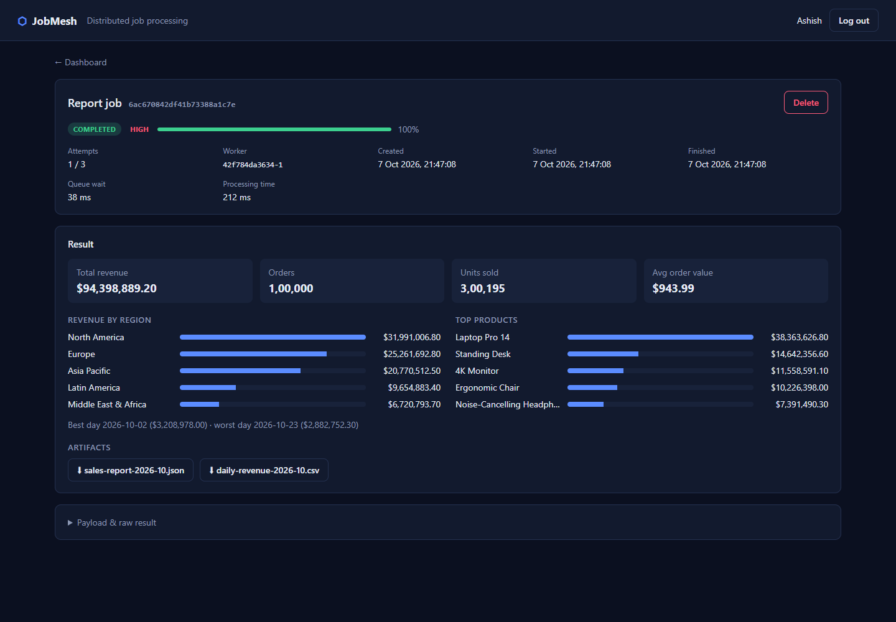
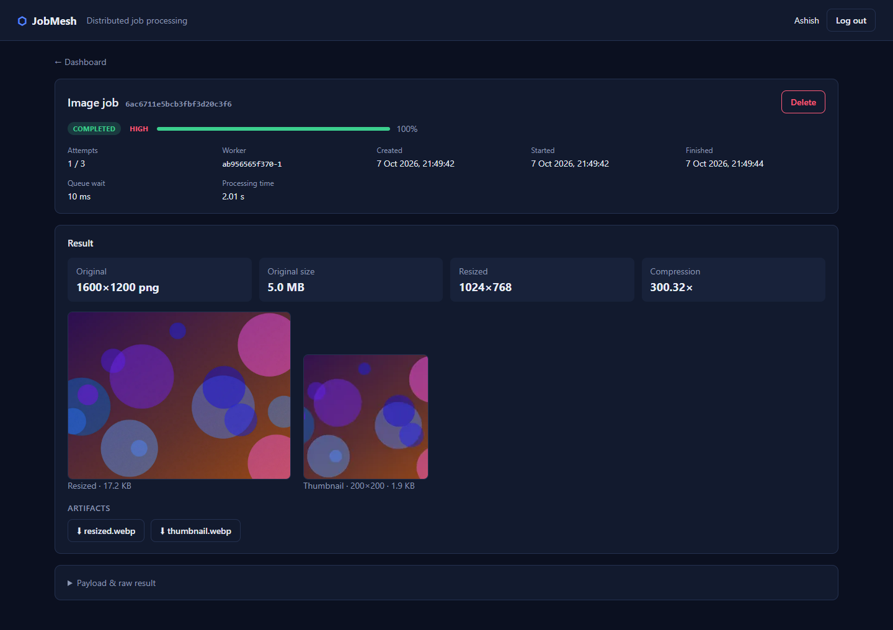

# JobMesh

**Distributed asynchronous job processing platform.**

Node.js · Express · MongoDB · Redis · BullMQ · Docker · Jest · k6

The API accepts a job, stores it, puts a reference on a Redis-backed queue and responds immediately with `202 Accepted`.
A pool of independent worker processes pulls jobs off the queue, runs them, and writes results back to MongoDB.
Workers scale horizontally (`docker compose up --scale worker=N`) and can crash at any point without losing or double-applying work.



```text
              ┌──────────────┐
              │ React (Vite) │  served by nginx, /api proxied to the API
              └──────┬───────┘
                     │ REST + JWT
                     ▼
              ┌──────────────┐   job metadata   ┌───────────┐
              │ Express API  │ ───────────────► │  MongoDB  │ ◄──────┐
              │ (producer)   │                  └───────────┘        │
              └──────┬───────┘                                       │
                     │ { jobId }                                     │ status / result
                     ▼                                               │
              ┌──────────────┐  cache, rate limits, cancel flags     │
              │ Redis/BullMQ │  worker heartbeats                    │
              └──────┬───────┘                                       │
          ┌──────────┼──────────┐                                    │
          ▼          ▼          ▼                                    │
      Worker 1   Worker 2   Worker N   ──────────────────────────────┘
```

## Features

- **Asynchronous processing:** submission costs one insert into MongoDB and one push onto the queue. The expensive work happens elsewhere.
- **Three job types:** CSV validation and aggregation (streamed, constant memory), image resize/compress/thumbnail (sharp), and monthly sales report generation. Each produces downloadable artifacts.
- **Horizontally scalable workers:** stateless processes coordinated only through Redis.
- **Priority queues:** HIGH / MEDIUM / LOW map to BullMQ priorities.
- **Automatic retries with exponential backoff** (1s, 2s, 4s, …). Non-retryable errors (corrupt input) fail immediately.
- **Failed-job handling:** jobs that exhaust retries are marked `FAILED` and can be retried manually via the API.
- **Idempotency:** at-least-once delivery from the queue is made safe by conditional state transitions. Clients can send an `Idempotency-Key` header so a double-clicked submission creates one job.
- **Cancellation:** queued jobs are removed from the queue. Running jobs stop cooperatively.
- **Crash recovery and graceful shutdown:** killed workers' jobs are re-delivered after their lock expires. `SIGTERM` finishes in-flight jobs first.
- **Redis caching** of job reads (cache-aside, 60s TTL, invalidated on every state change) with an `X-Cache: HIT|MISS` header.
- **Rate limiting:** per-user sliding-window counter, implemented as an atomic Redis Lua script. Bulk submissions are charged per job.
- **Cursor pagination, compound indexes, Dockerized deployment, health and readiness probes.**
- **React dashboard:**
  - Live stats, queue depth and worker heartbeats.
  - Job submission, including file upload, bulk copies and fault injection.
  - Filterable job table and per-job pages with progress, attempts and the worker that ran it.
  - Type-specific results (charts, image previews, artifact downloads), plus cancel, retry and delete actions.

## Quick start

Prerequisites: Docker and Node.js 22.9+.

```bash
npm install
docker compose up -d --build          # mongodb, redis, api, 3 workers, dashboard
open http://localhost:8080            # dashboard (API at http://localhost:4000)
npm run test:e2e                      # end-to-end checks against the running stack
```

To run the services on the host instead of in containers (for development with hot reload):

```bash
cp .env.example .env
npm install --prefix frontend
npm run infra:up                      # only mongodb + redis in Docker
npm run dev:api                       # terminal 1
npm run dev:worker                    # terminal 2 (start several for a pool)
npm run dev:web                       # terminal 3, http://localhost:5173 (proxies /api)
```

| Job details: report | Job details: image |
|---|---|
|  |  |

### Try it

```bash
TOKEN=$(curl -s localhost:4000/api/auth/register -H 'Content-Type: application/json' \
  -d '{"name":"Ash","email":"ash@example.com","password":"password123"}' | jq -r .token)

curl -s localhost:4000/api/jobs -H "Authorization: Bearer $TOKEN" -H 'Content-Type: application/json' \
  -d '{"type":"CSV_PROCESSING","priority":"HIGH","payload":{"synthetic":{"rows":50000}}}'

curl -s localhost:4000/api/stats -H "Authorization: Bearer $TOKEN"
```

## Free deployment (Render + MongoDB Atlas)

[](https://render.com/deploy?repo=https://github.com/ashish04042004/jobmesh)

Free tiers usually allow one web service, so `deploy/Dockerfile` builds a single image:

- `deploy/standalone.js` runs the API and an embedded worker as two processes.
- Express serves the built dashboard on the same origin.
- `render.yaml` creates that web service plus a free Render Key Value (Redis) instance with `noeviction`, and generates `JWT_SECRET`.

To deploy:

1. Create a free **M0** cluster on [MongoDB Atlas](https://www.mongodb.com/cloud/atlas/register).
   - Add a database user.
   - Allow access from `0.0.0.0/0`, because Render's free plan has no static IPs.
   - Copy the connection string and add a database name, e.g. `.../jobmesh?retryWrites=true&w=majority`.
2. Click **Deploy to Render**, sign in with GitHub, and paste the string into `MONGO_URI` when asked.
3. Open `https://<service-name>.onrender.com` once the build finishes.

Free-tier trade-offs:

- The service sleeps after 15 minutes without traffic. The first request after that takes about a minute while it wakes up.
- Uploaded files and generated artifacts live on ephemeral disk and are gone after a restart. Job records and results stay in MongoDB.
- The instance has about 0.1 CPU, so jobs run much slower than on a laptop.

## API

| Method | Path | Description |
|---|---|---|
| POST | `/api/auth/register` | Create account, returns JWT |
| POST | `/api/auth/login` | Returns JWT |
| GET | `/api/auth/me` | Current user |
| POST | `/api/jobs` | Submit a job (`202`; optional `Idempotency-Key` header) |
| POST | `/api/jobs/bulk` | Submit up to 100 jobs in one request (optional `batchId`) |
| GET | `/api/jobs` | List jobs. Filters: `status`, `type`, `batchId`; pagination: `cursor`, `limit` |
| GET | `/api/jobs/:id` | Job details (Redis-cached) |
| POST | `/api/jobs/:id/cancel` | Cancel a queued or running job |
| POST | `/api/jobs/:id/retry` | Re-run a `FAILED` or `CANCELLED` job |
| DELETE | `/api/jobs/:id` | Delete a job that is not running, plus its artifacts |
| POST | `/api/files` | Upload a CSV or image (multipart field `file`) |
| GET | `/api/files` | List uploads and generated artifacts |
| GET | `/api/files/:id/download` | Download a file |
| GET | `/api/stats` | Counts by status, average processing time, queue depth, live workers |
| GET | `/api/stats?batchId=…` | Batch throughput and latency percentiles (used by the benchmark) |
| GET | `/health`, `/ready` | Liveness, and readiness (checks MongoDB + Redis) |

Job payloads:

```jsonc
{ "type": "CSV_PROCESSING", "payload": { "fileId": "…" } }                     // or { "synthetic": { "rows": 50000 } }
{ "type": "IMAGE_PROCESSING", "payload": { "fileId": "…", "resize": { "width": 1024 }, "thumbnailSize": 200, "format": "webp" } }
{ "type": "REPORT_GENERATION", "payload": { "month": "2026-09", "records": 100000 } }
```

Any payload can include `"simulate": { "failAttempts": 2, "delayMs": 5000 }` to exercise retries, backoff and cancellation.

## How it works

### Job lifecycle

```text
                 cancel                     cancel
   ┌──────────────────────────┐   ┌────────────────────────┐
   │                          ▼   │                        ▼
QUEUED ──claim──► PROCESSING ──success──► COMPLETED    CANCELLED
   ▲                  │                                    │
   └── retryable ─────┤                                    │
       failure        └── final failure ──► FAILED ◄───────┘
                                              │      (manual retry → QUEUED)
                                              └──────────────────────────────
```

MongoDB is the source of truth. The queue message carries only `{ jobId }`.

### Idempotency: at-least-once delivery, effectively-once results

BullMQ guarantees a job is delivered **at least once**. A worker can finish the work, then crash before acknowledging it, so the job gets delivered again.
Every write the worker makes is therefore a conditional update ([`worker/src/jobHandler.js`](worker/src/jobHandler.js)):

| Transition | Filter | If the filter doesn't match |
|---|---|---|
| claim | `status ∈ {QUEUED, PROCESSING}` | skip: already completed, cancelled or deleted |
| complete | `status = PROCESSING` | discard: the job was cancelled mid-run |
| fail / requeue | `status = PROCESSING` | no-op |

Other parts of the design also make re-running harmless:

- Synthetic workloads are seeded from the job id, so a re-run produces identical results.
- Artifacts are upserted on `(jobId, name)` under a unique index.
- The BullMQ job id is derived from the Mongo id, so enqueueing the same job twice is a no-op.

On the API side, an `Idempotency-Key` is backed by a unique partial index on `(userId, idempotencyKey)`, which deduplicates even concurrent duplicate requests.

### Failure modes

| Scenario | What happens |
|---|---|
| Worker crashes mid-job | Its lock expires (30s), and the stalled-job checker re-queues the job for another worker (verified with `docker kill`). |
| Job keeps crashing workers | After `maxStalledCount` it is failed. A `failed` listener reconciles MongoDB to `FAILED`. |
| Processor throws | Retried with exponential backoff up to `JOB_ATTEMPTS`, then `FAILED`. `UnrecoverableError` skips retries. |
| Redis down at submit time | The job is recorded as `FAILED` ("queue unavailable") and the API returns `503`. The user can retry it later. A transactional outbox would close this gap completely. |
| Redis down for cache or rate limiter | Both fail open: requests still succeed, just slower and unthrottled. |
| `SIGTERM` (deploy, scale-down) | The worker stops fetching, finishes in-flight jobs (Compose allows 30s), deregisters its heartbeat and exits. |

### Caching and rate limiting

- `GET /api/jobs/:id` uses cache-aside with a 60s TTL. Both the API and the workers delete the key on every state or progress change. The TTL bounds staleness if an invalidation races with a read.
- `/api/stats` is cached for 5s, because a dashboard tolerates slight staleness better than an aggregation on every poll.
- Rate limits use a sliding-window counter: the previous window's count is weighted by how much of it still overlaps. This smooths out the burst a fixed window allows at window boundaries. The read and increment happen in one Lua script, so concurrent requests can't race. In testing, 110 concurrent submissions against a limit of 100 produced exactly 100 accepted and 10 rejected with `429`.

### Production notes

- Redis runs with AOF persistence and `maxmemory-policy noeviction`. BullMQ requires noeviction, otherwise Redis could silently drop queue keys under memory pressure. At larger scale, the cache would move to a separate Redis using `allkeys-lru`.
- Each worker uses two Redis connections, so BullMQ's blocking reads don't delay cache, heartbeat and cancellation commands.
- CPU-bound processors yield to the event loop between chunks, so BullMQ can renew job locks.

## Testing

```bash
npm test            # 63 unit + integration tests (Jest, Supertest, mongodb-memory-server). No Redis needed.
npm run test:e2e    # 9 end-to-end tests against the running Docker stack
```

The API is built with dependency injection: `createApp({ queueGateway, cache, rateLimitStore })`. Tests use in-memory implementations of those three, with a real MongoDB.
The worker tests drive the job state machine directly. They cover duplicate delivery, crash re-claim, cancellation races, retry versus final failure, and reconciliation.

## Benchmarks

Start the stack with rate limits lifted:

```bash
docker compose -f docker-compose.yml -f docker-compose.bench.yml up -d --build
```

**Worker scaling.** For each worker count, the script scales the worker service, submits an identical batch, waits for it to drain, and records throughput, latency percentiles and worker CPU:

```bash
node load-tests/benchmark-workers.js --workers 1,2,4,8 --jobs 2000 --rows 50000
```

**API load (k6).** For example, 100 concurrent users submitting 10,000 jobs:

```bash
docker run --rm -i --network jobmesh_default -v "$PWD/load-tests:/scripts" \
  -e BASE_URL=http://backend:4000 -e VUS=100 -e JOBS=10000 \
  grafana/k6 run --summary-export=/scripts/results/k6-summary.json /scripts/k6.js
```

### First results

These come from a single validation run, not a tuned benchmark. Setup:

- Machine: i5-11400H laptop (6 cores / 12 threads), Docker Desktop on WSL2.
- Workload: 600 CSV jobs × 50,000 rows each, with `WORKER_CONCURRENCY=2`.

| Workers | Makespan (s) | Throughput (jobs/s) | Speedup | Processing p50 / p95 (ms) | Worker CPU (%) |
|---:|---:|---:|---:|---:|---:|
| 1 | 45.3 | 13.2 | 1.00× | 141 / 192 | 97 |
| 2 | 28.6 | 21.0 | 1.58× | 175 / 253 | 189 |
| 4 | 22.0 | 27.3 | 2.06× | 251 / 463 | 373 |
| 8 | 19.5 | 30.8 | 2.32× | 467 / 647 | 734 |

What the numbers show:

- Each worker process saturates about one core (around 97% CPU per worker), so this workload is CPU-bound.
- Throughput grows with workers, but sub-linearly. Past 4 workers, the pool runs 8 × 2 concurrent CPU-bound jobs on 6 physical cores.
- Per-job processing time rising from 141 ms to 467 ms confirms the bottleneck is CPU contention, not the queue. The API accepted submissions at more than 1,200 jobs/s throughout.

On this machine, the useful scaling limit is roughly the physical core count. Going further means more machines, not more processes per machine.

## Project structure

```text
shared/     Mongoose models, constants, Redis/BullMQ/Mongo factories (used by API and workers)
backend/    Express API: routes → controllers → services; Redis adapters; Jest + Supertest tests
worker/     BullMQ worker: idempotent job handler, per-job context, processors; Jest tests
frontend/   React + Vite dashboard; nginx image proxies /api to the backend
tests/e2e/  End-to-end tests (node:test) against the running stack
load-tests/ k6 API load test and worker-scaling benchmark
```

## Roadmap

- Server-sent events instead of polling for live job progress.
- Transactional outbox for submissions, and Prometheus metrics.
